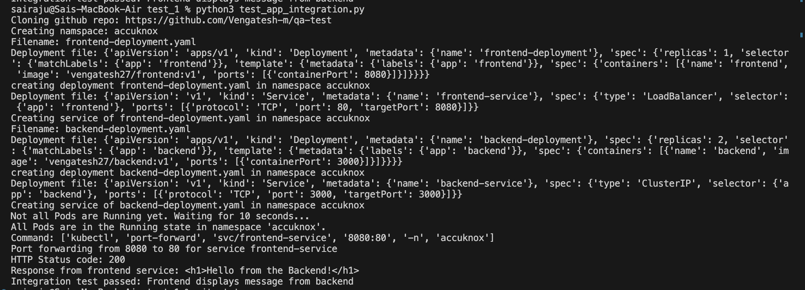
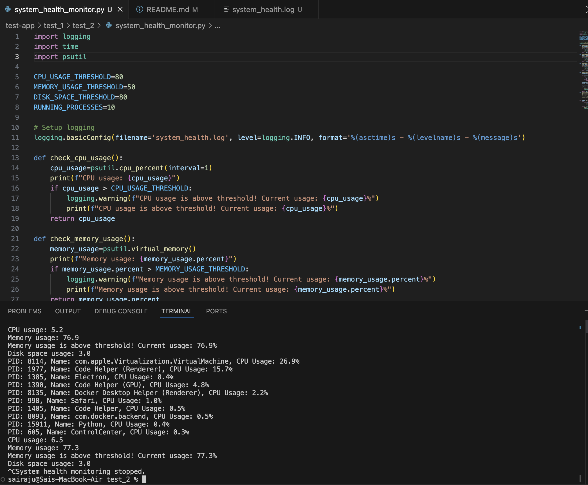
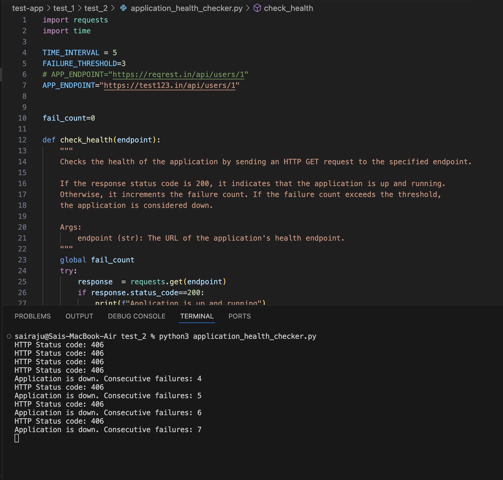

# Test Deployment and Integration Testing

This repository contains scripts to deploy a frontend and backend application on a Kubernetes cluster and perform integration testing.

## Prerequisites

- Python 3.x
- Git
- Kubernetes cluster configured
- `kubectl` configured to interact with your Kubernetes cluster
- `pip` to install required Python packages

**Note**: Git cloning, application deployment & integration test all are taken care with python scripting so that no manual intervention is required.

## Deployment and Testing

### Step 1: Clone the Git Repository

The repository containing the deployment files needs to be cloned first.

### Step 2: Deploy the Application

Deploy the frontend and backend services in a specified namespace on the Kubernetes cluster.

### Step 3: Port Forwarding

Since the Kind cluster’s load balancer can’t be accessed directly from localhost, we port-forward the frontend service to localhost.

### Step 4: Integration Testing

Run integration tests to verify that the frontend correctly interacts with the backend.

### Step 5: Cleanup

Cleanup the namespace and the cloned repository after the tests.

## Script Details

[deploy_app.py](./test_1/deploy_app.py)

This script contains functions for deploying the application on Kubernetes, port forwarding, and cleanup.

#### Functions:

- `clone_git_repo(url)`: Clone the Git repository to the current working directory.
- `deploy_app(namespace)`: Deploy frontend and backend deployments in the given namespace.
- `wait_for_pods_to_be_running(namespace_name, timeout=300, interval=10)`: Wait for all Pods in the namespace to be in the Running state.
- `port_forward(service_name, namespace_name, local_port, remote_port)`: Port forward the specified service.
- `cleanup_namespace(namespace)`: Delete the created namespace.
- `cleanup_repo(directory)`: Delete the cloned repository directory.

### test_app_integration.py

This script uses the functions from `deploy_app.py` to automate the entire process of deployment, port forwarding, testing, and cleanup.

#### Variables:

- `REPO_URL`: URL of the Git repository containing the deployment files.
- `SERVICE_NAME`: Name of the frontend service.
- `NAMESPACE_NAME`: Namespace to deploy the application.
- `LOCAL_PORT`: Local port for port forwarding.
- `REMOTE_PORT`: Remote port of the service.
- `FRONTEND_URL`: URL of the frontend service after port forwarding.
- `EXPCTED_RESPONSE`: Expected response from the backend.

#### Functions:

- `test_integration(frontend_url)`: Test the integration between frontend and backend services.
- `main()`: Main function to orchestrate the entire process.

## Running the Tests

1. Run the integration test script:

    ```bash
    python3 test_app_integration.py
    ```
    

___
# System Health Monitoring Script

This script monitors the health of a Linux system by checking CPU usage, memory usage, disk space, and running processes. If any of these metrics exceed predefined thresholds, the script sends an alert to the console and logs the details into a log file.

## Features

- **CPU Usage Monitoring**: Checks the CPU usage percentage and alerts if it exceeds the threshold.
- **Memory Usage Monitoring**: Checks the memory usage percentage and alerts if it exceeds the threshold.
- **Disk Space Usage Monitoring**: Checks the disk space usage percentage and alerts if it exceeds the threshold.
- **Running Processes Monitoring**: Lists the top CPU-consuming processes.

## Prerequisites

- Python 3.x
- `psutil` library

## Usage

1. **Run the Script**: Execute the script using Python.

    ```bash
    python3 system_health_monitor.py
    ```
    

2. **Review the Log File**: Check the `system_health.log` file for any warnings or information about system health.

## Script Details

[system_health_monitor.py](./test_2/system_health_monitor.py)

This script contains functions to monitor system health and log alerts if any metrics exceed predefined thresholds.

#### Functions:

- `check_cpu_usage()`: Checks CPU usage and logs a warning if it exceeds the threshold.
- `check_memory_usage()`: Checks memory usage and logs a warning if it exceeds the threshold.
- `check_disk_space_usage()`: Checks disk space usage and logs a warning if it exceeds the threshold.
- `check_running_processes()`: Lists top CPU-consuming processes.
- `monitor_system()`: Orchestrates the health checks.

#### Logging

The script logs warnings to `system_health.log` and prints alerts to the console.

**Note**: The script runs indefinitely. To stop it, use `Ctrl + C` in the terminal.

___

# Application Health Checker

This script checks the uptime of an application by verifying its HTTP status codes. It determines if the application is 'up' and functioning correctly or 'down' and not responding.

## Features

- **Uptime Monitoring**: Checks the application's status by sending an HTTP GET request to the specified endpoint.
- **Failure Detection**: Detects if the application is down after a number of consecutive failures.

## Prerequisites

- Python 3.x
- `requests` library

## Usage

1. **Run the Script**: Execute the script using Python 3.

    ```sh
    python3 application_health_checker.py
    ```

## Script Details

[application_health_checker.py](./test_2/application_health_checker.py)

This script contains functions to check the health of an application by sending HTTP GET requests to the specified endpoint and determining if the application is up or down based on the HTTP status codes.

#### Functions:

- `check_health(endpoint)`: Sends an HTTP GET request to the specified endpoint and checks the application's health based on the HTTP status code. Increments the failure count if the status code is not 200. Logs and prints if the application is down after consecutive failures.
    - **Arguments**: `endpoint (str)`: The URL of the application's health endpoint.
    - **Raises**: `requests.RequestException`: If there is an issue with the HTTP request.

#### Main Loop

The main loop continuously monitors the application's health at the specified time interval.

**Note**: The script runs indefinitely. To stop it, use `Ctrl + C` in the terminal.

**Example:**

```sh
python3 application_health_checker.py
```
